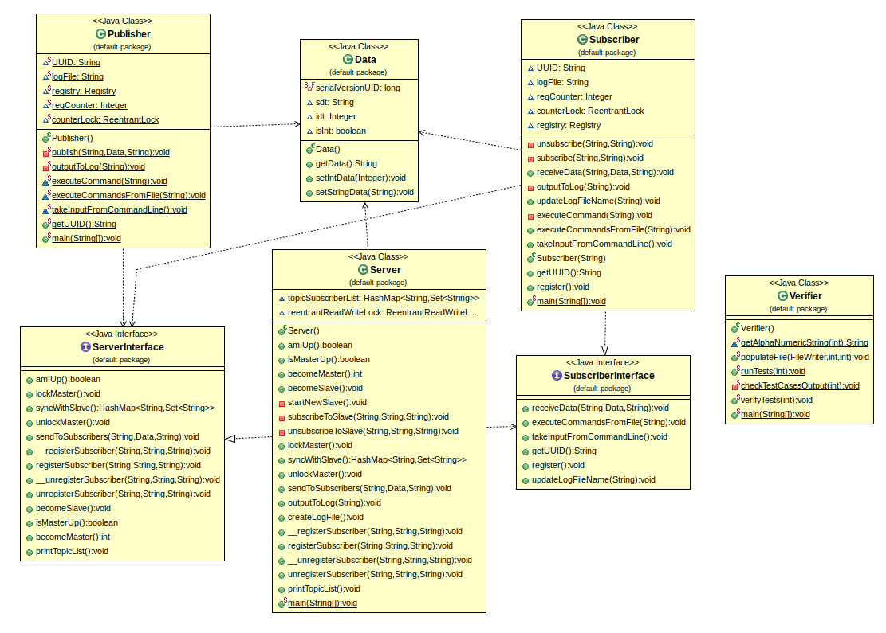

## Publisher Subscriber Pattern

### How to Run and test?
- Compile all source files using ```javac *.java```
- The ShardCoord is responsible for running all ShardRegion instances.
- Run RMI registry using ```rmiregistry```.
- Create a new terminal tab using Ctrl+Shift+T for each of the below commands.
- Run Server using ```java Server```. Run Publisher using ```java Publisher```. Run Subscribers using ```java Subscriber``` multiple times. You can subscribe to a topic in a server using "S topic_name" and unsubscribe using "U topic_name". To send to a particular topic from Publisher, use "topic_name message".
- Alternatively, you can also create and run the test cases using ```java Verifier```. This will create the test cases in ```tests/input.txt```. It will also then run the test cases using our code and produce the output in ```logs/``` directory. It will also create expected_output for the test cases in ```tests/expected_output/``` directory.  It will then diff the contents of files in ```logs/``` and ```tests/expected_output/``` to see if correct result is being produced and will prompt if all test cases have passed or not.

### UML Class Diagram
UML Diagram is in uml.png.

